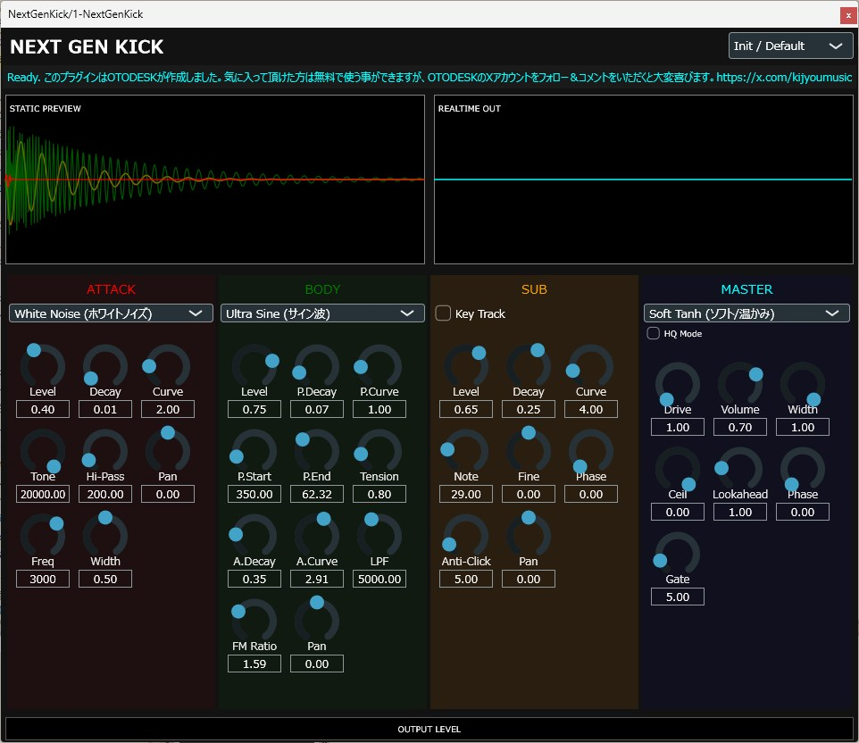

\# NEXT GEN KICK

\*\*プロフェッショナル・キックドラム・シンセサイザー・プラグイン\*\*

3層構造（Attack/Body/Sub）、100種類のプリセット、11種類のサチュレーションを搭載した高品質な無料キック音源です。

https://github.com/OTODESK4193/next-gen-kick

- ツール本体: [ダウンロード](https://github.com/OTODESK4193/next-gen-kick/releases/tag/v1.0.0))
- マニュアルPDF: [マニュアル](./NEXT_GEN_KICK_manual.pdf)

---

\## ✨ 特徴

\- \*\*3層サウンドエンジン\*\*: Attack（アタック）、Body（ボディ）、Sub（サブ）の独立制御

\- \*\*100種類のプリセット\*\*: EDM、ハウス、トラップ、ハードコア、ヴィンテージなど

\- \*\*11種類のサチュレーション\*\*: Soft Tanh、Hard Clip、Triode、Tape、Wavefoldなど

\- \*\*物理モデリング\*\*: Von Karman膜理論による張力シミュレーション

\- \*\*高品質モード\*\*: 2倍オーバーサンプリング＆アンチエイリアシング

\- \*\*リアルタイム波形表示\*\*: 各レイヤーを色分けして個別表示

\- \*\*ルックアヘッドリミッター\*\*: トランジェント保護＆クリッピング防止

\- \*\*MIDIキートラッキング\*\*: Subレイヤーが音程追従可能

---

\### インストール方法

\#### Windows

1\. ZIPファイルをダウンロード

2\. 右クリック → 「すべて展開」

3\. `Next Gen Kick.vst3` フォルダを `C:\\Program Files\\Common Files\\VST3\\` にコピー

4\. DAWでプラグインを再スキャン

\## 📖 使い方

\### 基本的なワークフロー

1\. プリセットを選択（100種類から）

2\. Body の P.End で基音を調整

3\. Attack で質感を調整

4\. Master の Distortion で歪みを追加

5\. Volume と Width で最終調整

\### 詳しい使い方

\[完全マニュアル（日本語）](docs/manual\_ja.md)

\## 🎛️ パラメーター概要

\### Attack セクション

クリック音を生成します。

\- \*\*Type\*\*: 8種類の波形（ノイズ、矩形波、ノコギリ波など）

\- \*\*Decay/Curve\*\*: エンベロープの形状

\- \*\*Tone/Hi-Pass\*\*: フィルター

\### Body セクション

キックの本体（ピッチスイープ）を生成します。

\- \*\*Type\*\*: 5種類の波形（サイン波、ベッセル、矩形波など）

\- \*\*Pitch Start/End\*\*: スイープ範囲

\- \*\*Tension\*\*: 膜の張力シミュレーション

\### Sub セクション

超低域のサブベースを生成します。

\- \*\*Key Track\*\*: MIDIノート追従のON/OFF

\- \*\*Note/Fine\*\*: ピッチ調整

\- \*\*Phase\*\*: Body との位相関係

\### Master セクション

最終的な音質調整とリミッター。

\- \*\*Distortion\*\*: 11種類のサチュレーション

\- \*\*Drive\*\*: 歪みの深さ

\- \*\*Width\*\*: ステレオ幅

---

\## 🐛 トラブルシューティング

\### プラグインが表示されない

\- VST3フォルダに正しくコピーされているか確認

\- DAWでプラグイン再スキャンを実行

\- DAWを再起動

---

\## 📜 ライセンス

このプロジェクトは \*\*GNU General Public License v3.0\*\* の下でライセンスされています。

詳細は \[LICENSE](LICENSE) ファイルを参照してください。

\### サードパーティライセンス

\- \*\*JUCE Framework\*\*: \[GPL v3 / Commercial](https://juce.com/juce-8-licence)

---

\## 🙏 クレジット

\*\*開発者\*\*: OTODESK  

\*\*X (Twitter)\*\*: \[@kijyoumusic](https://x.com/kijyoumusic)

このプラグインを気に入っていただけたら：

\- ⭐ このリポジトリにスターをつける

\- 🐦 X/Twitterでフォロー

\- 💬 あなたの作品をシェア

していただけると大変嬉しいです！

---

